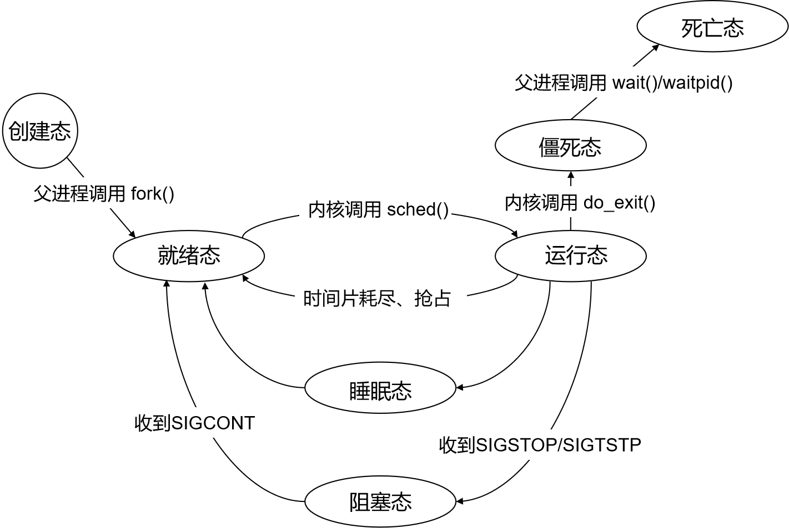
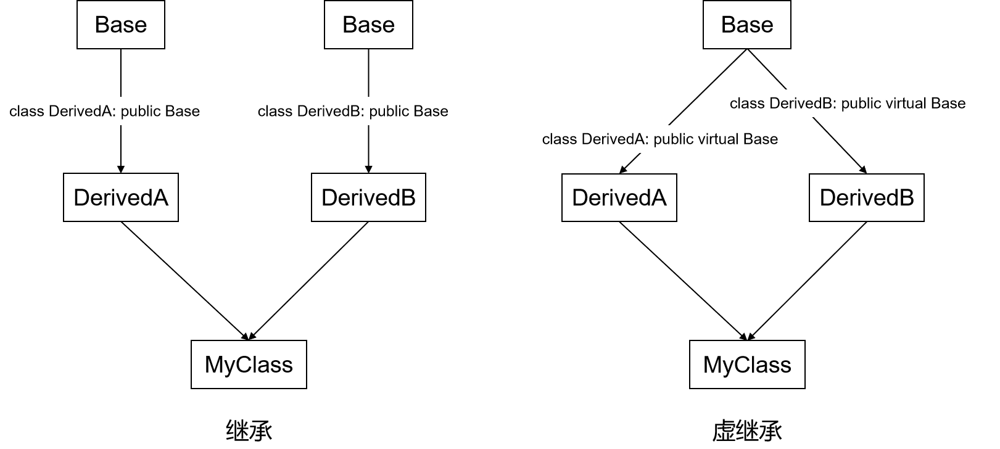
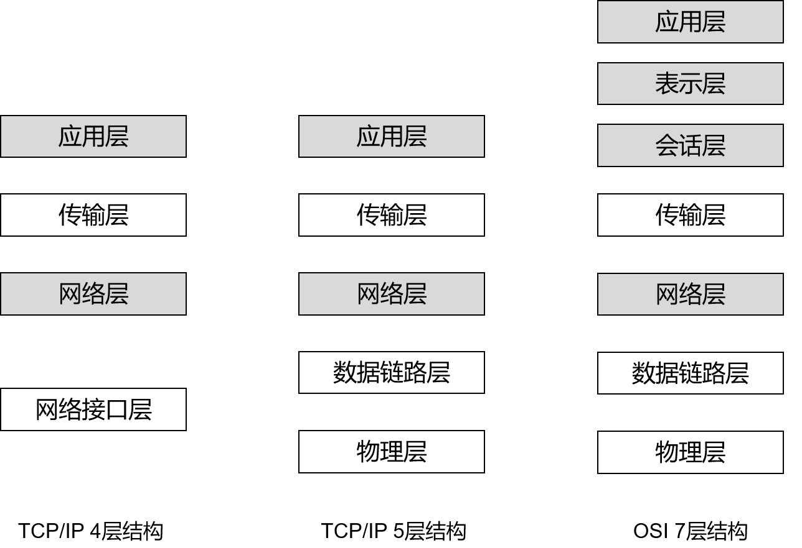
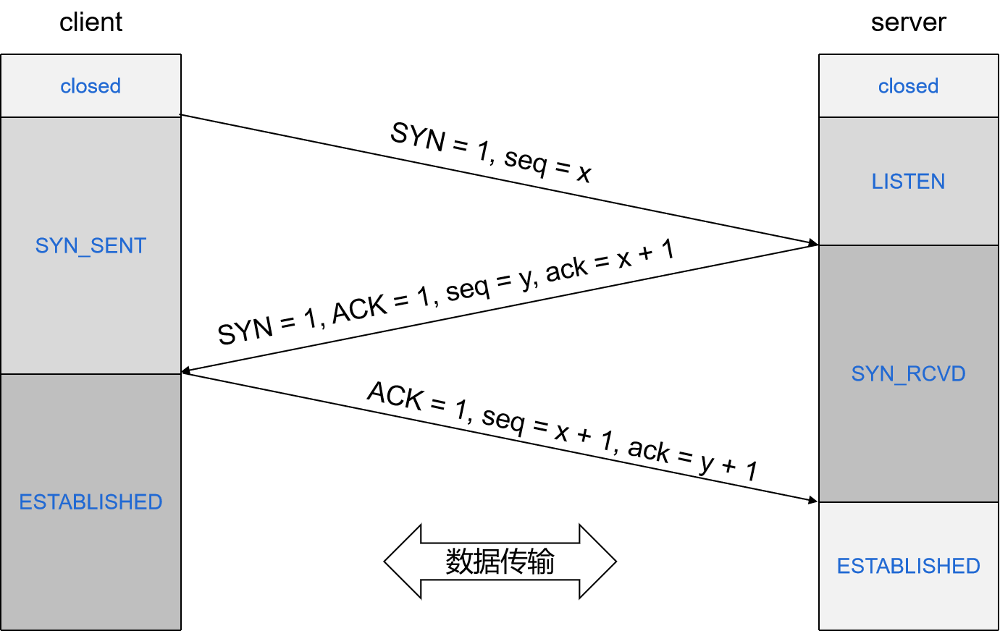
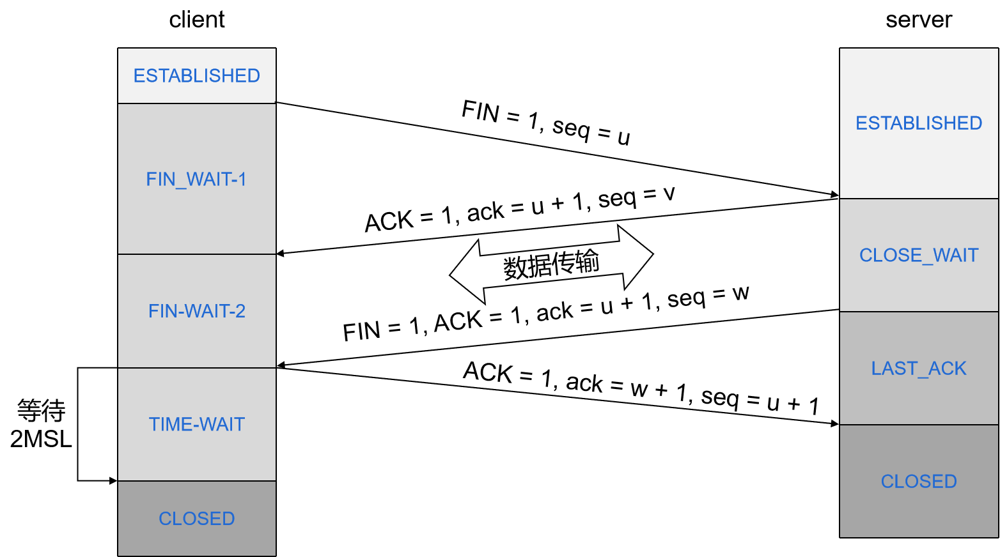

### Preparation for autumn recruit

### 一、线程与进程

#### 1. 进程和线程的区别

进程是资源分配的最小单位，线程是CPU调度的最小单位。

举一个简单的例子，通过`pthread_create()`创建出来的线程共享当前进程空间的地址，创建的子线程可以直接访问主线程的全局变量等。而通过`fork()`创建的进程，其进程空间与主进程空间是不同的，它在创建的时候拷贝了父进程空间的变量，因此它对变量的改变不会影响到主进程空间的变量。

具体区别：
1. 进程有独立的地址空间，而线程没有。
2. 线程之间通信比进程之间通信更加方便。（全局变量）
3. 进程切换比线程切换开销更大。（进程有虚拟地址空间切换）
4. 一个线程挂掉会导致整个进程挂掉，而一个进程挂掉不会影响其他进程。

此外，一个进程可以包含多个线程。

#### 2. 多进程和多线程的优缺点

探讨多进程和多线程的优缺点之前，需要先了解进程和线程的联系。一个进程由PCB（进程控制块）、数据段、代码段组成，进程本身不可以运行程序，而是像一个容器一样，先创建出一个主线程，分配给主线程一定的系统资源，主线程运行执行功能。当要实现比较复杂的功能时，可以在主线程里创建多个子线程，多个线程运行在一个进程中，共享这个进程所拥有的系统资源。

多进程优点：
1. 多进程更加健壮，一个进程挂掉不影响其他进程，因为系统给每个进程分配了独立的系统资源。而多线程比较脆弱，一个线程崩溃可能导致整个程序崩溃，因为多个线程工作于一个进程空间。
2. 进程性能大于线程的性能，因为每个进程有独立的空间和资源，而多线程共享同一个进程里的空间和资源。此外，多进程可以通过增加CPU和内存提高性能上限，而多线程则局限于所在进程的内存空间。

多进程缺点：
1. 进程切换的开销大于线程切换。（虚拟地址空间切换）
2. 进程间通信比较麻烦。

多线程优点：
1. 线程切换开销小。
2. 线程间通信和共享很方便。

多线程缺点：
1. 所有线程共享内存空间，受限于进程的2GB地址空间。
2. 线程同步和加锁比较麻烦。
3. 一个线程崩溃会影响到整个程序的稳定性。
4. 当线程到达一定数量后，无法通过增加CPU提高性能，因此性能上限有限。

#### 3. 什么时候用进程，什么时候用线程

1. 需要频繁创建和销毁的优先使用线程，因为进程创建开销大。
2. 切换频繁的时候使用线程，因为线程切换比进程切换快。
3. 并行操作时使用线程，如C/S架构的服务器并发线程响应用户的请求。
4. 多机系统用多进程，多核系统可用多线程。
5. 稳定性要求高的情况使用多进程。

#### 4. 多进程、多线程同步（通信）方式

进程间通信：管道、消息队列、共享内存、信号量、socket等

线程间同步：信号量、读写锁、互斥锁、自旋锁、条件变量、栅栏等

#### 5. 进程的空间模型

在32位系统中，当系统运行一个程序，就会创建一个进程，系统为其分配4G的虚拟地址空间，其中0-3G是用户空间，3-4G是内核空间，具体如下图所示：
<div align = 'center'>

</div>

其中，内核是受保护的，用户不能对该空间进行读写操作，否则可能出现段错误。

栈空间有向下的箭头，代表数据地址增加的空间是往下的，而堆的空间则是往上的。

1. 栈区：由编译器自动分配和释放，存放函数的参数值、局部变量等。
2. 堆区：一般由程序员进行分配和释放，若程序员不释放，则可能导致内存泄漏。当程序结束后，可能由操作系统进行回收。
3. .bss：用来存放程序中未初始化或者初始化为0的全局变量和静态变量。
4. .data：用来存放程序中已经初始化的全局变量。
5. .text：用来存放代码的一段内存区域。

注：64位操作系统下的内存空间大小不是2^32^或者2^64^，而是 2^48^。`0x0000000000000000-0x00007fffffffffff`表示用户空间，`0xffff800000000000-0xffffffffffffffff`表示内核空间，并提供`256TB`（2^48^）的寻址空间。

#### 6. 一个进程可以创建多少个线程，和什么有关

一个进程创建的个数和虚拟内存大小和线程的栈的大小有关。

例如，Windows下一个进程可用虚拟内存大小为2G，线程栈大小一般为1M，所以理论上可以创建2048个线程。 

#### 7. 进程的状态转换图，什么时候阻塞，什么时候就绪

进程的最基本状态有三个：运行态、就绪态、阻塞态。

其中：
1. 运行态：进程正处于运行状态。
2. 就绪态：进程可以被调度，但由于未获得CPU时间片，因此处于等待状态。
3. 阻塞态：进程由于等待某个条件达成而进入了休眠状态，当条件达成则唤醒该进程，并随时准备再次投入运行。

实际上进程状态不止上述三个：
1. 创建态：一个进程正在被创建，还没有转到就绪之前的状态。
2. 就绪态：一个进程获得了除CPU时间片以外所需资源，一旦得到CPU时间片即可运行。
3. 运行态：一个进程得到CPU调度正在运行的状态。
4. 睡眠/挂起态：由于某些资源暂时不可得到进入“睡眠态”，进程挂起，等待唤醒。
5. 阻塞态：一个进程正在等待某一个事情而暂停运行。如等待某资源可用或者等待IO完成等。
6. 结束/僵死态：由于进程结束或者其他原因导致进程正在从系统中消失的状态。
7. 死亡态：进程声明周期已经结束，将占用的资源归还给系统。

<div align = 'center'>

</div>

#### 8. 父进程、子进程的关系和区别

子进程从父进程继承的主要有：用户号和用户组号；堆栈；共享内存；目录；打开的文件描述符；

父进程和子进程拥有独立的地址空间和PID参数、不同的父进程号、自己的文件描述符等。

#### 9. 什么是进程上下文、什么是中断上下文

进程上下文实际上是进程执行活动全过程的静态描述。我们把已经执行过的进程指令和数据在相关寄存器与堆栈中的内容称为上文，把正在执行的指令和数据在寄存器和堆栈中的内容称为正文，把待执行的指令和数据在寄存器和堆栈中的内容称为下文。具体来说，进程上下文包括计算机系统中与执行该进程有关的各种寄存器的值、程序段在经过编译之后形成的机器指令代码集，数据集及各种堆栈、PCB结构等。

用户空间的应用程序，通过系统调用进入内核空间。这个时候用户空间的进程要传递很多变量、参数的值给内核，内核运行的时候也要保存用户进程的一些寄存器值、变量等。所谓的“进程上下文”，可以看做是用户进程传递给内核的这些参数以及内核要保存的那一整套的变量和寄存器值和当前的环境等。

对于一个进程而言，进程上下文就是进程执行的环境。具体来说就是各个变量和数据，包括所有的寄存器变量、进程打开的文件、内存信息等。一个进程的上下文可以分为三个部分：用户级上下文、寄存器上下文、以及系统级上下文。
1. 用户级上下文：正文、数据、用户堆栈以及共享存储区。
2. 寄存器上下文：通用寄存器、程序寄存器（IP）、处理器状态寄存器（EFLAGS）、栈指针(ESP)等。
3. 系统级上下文：进程控制块（PCB）、内存管理信息、内核栈。

当发生进程调度时，进程进行切换就是上下文切换，操作系统必须将上述所有信息进行切换，新调度的进程才能运行。而系统调用发生的模式切换（用户态与内核态）要容易得多，因为模式切换最主要的任务是切换寄存器上下文。

中断上下文：硬件通过触发信号，导致内核调用中断处理程序，进入内核空间。这个时候，硬件的一些变量和参数也要传递给内核，内核通过这些参数进行中断处理。所谓的“中断上下文”，也可以看做是硬件传递过来的参数和内核需要保存的一些其他环境。

#### 10. 并发、同步、异步、互斥、阻塞、非阻塞

**并发与并行**：并发是指计算机系统在一个时间段内同时存在多个任务，而并行是指同时执行多个任务。例如，对于一个 4 核 CPU 的计算机，当进程数小于 4 时，不发生进程切换，此时可以说是并行程序；而当进程数大于 4 时，操作系统会对进程进行切换，使之看起来是同时执行，实则是交替执行，此时便是并发程序。

**线程同步与互斥**：线程同步是指多个线程之间的相互协作关系，是一个比较宽泛的概念。而线程互斥是指多个线程对于临界资源的独占使用，因此线程互斥可以看做是线程同步的一种特殊情况。

**同步与异步**：同步和异步强调的是消息通信机制。所谓同步，就是在发出一个“调用”时，在没有得到结果之前，该调用就不返回。而异步则是相反，“调用”在发出之后，这个调用就直接返回了，所以没有返回结果。

**阻塞与非阻塞**：阻塞和非阻塞强调的是程序在等待调用结果时的状态。阻塞调用是指调用结果返回之前，当前线程会被挂起。非阻塞是指不能立刻得到结果之前，该调用不会阻塞当前线程。

#### 11. 孤儿进程、僵尸进程、守护进程

**孤儿进程**：当父进程退出后它的子进程还在运行，那么这些子进程就是孤儿进程。孤儿进程将被init进程收养，并由init进程对它们完成状态手机工作。

**僵尸进程**：当子进程退出后父进程并未接受结束子进程（如调用waitpid获取子进程的状态信息），那么子进程仍停留在系统中，这就是僵尸进程。

**守护进程**：在后台运行不受终端控制的进程，例如输入输出。网络服务大部分都是守护进程。

#### 12. 正确处理孤儿进程、僵尸进程的方法

**孤儿进程的处理**：孤儿进程也就是没有父进程的进程，孤儿进程的处理由进程号为1的init进程负责，就像一个福利院一样，专门负责处理孤儿。当有孤儿进程需要处理的时候，系统就把孤儿进程的父进程设置为init，而init进程会循环地wait()它已经退出的子进程。

**僵尸进程的处理**：

如果父进程已知不调用wait/waitpid函数接收子进程，那么子进程就已知保存在系统里，占用系统资源，因此如果僵尸进程数量太多，那么就会导致系统空间爆满，无法创建新的进程。

正确的的处理方式可以这样子：系统规定，子进程退出后，父进程会自动收到SIGCHLD信号。因此需要在父进程里重置signal函数。每当子进程退出，父进程都会收到SIGCHLD信号，故通过signal函数，重置信号响应函数。
```cpp
void* handler(int sig){
    int status;
    if(waitpid(-1, &status, WNOHANG) >= 0){
        printf("child is die\n");
    }
}
int main(){
    signal(SIGCHLD, handler);
    int pid = fork();
    if(pid > 0){
        while(1){
            sleep(2);
        }
    }else if(0 == pid){
        printf("I am child, i die\n");
    }
}
```

### 二、C/C++高频面试题

#### 1. new 和 malloc 的区别

1. `new/delete`是`C++`中的操作符，而`malloc/free`是标准库函数。
2. `malloc/free`不能够自动调用构造函数和析构函数。而`new`在为对象申请分配内存空间时，可以自动调用构造函数，同时也可以完成对对象的初始化。同理，`delete`也可以自动调用析构函数。
3. `new`可以自动计算所申请内存的大小，而`malloc`需要我们计算申请内存的大小。
4. `new`返回的是对象类型的指针，而`malloc`返回的是`void*`类型的指针，需要我们进行强制转换。
5. `new/delete`可以被重载，而`malloc/free`不能被重载。
6. `new`失败的时候会抛出`bad_alloc`异常，而`malloc`失败返回`NULL`。
7. `new`操作符从自由存储区（freestore）上为对象动态分配内存空间，而`malloc`函数从堆上动态分配内存。（自由存储区是C++基于`new`操作符的一个抽象概念，凡是通过`new`操作符进程内存申请，该内存即为自由存储区。而堆是操作系统中的术语，是操作系统所维护的一块特殊内存，用于程序的内存动态分配。）

#### 2. malloc的底层实现

<div align = 'center'>

</div>

回顾进程的空间模型，上图多了一个`program break`指针，linux维护一个`break`指针，这个指针指向堆空间的某个地址。从堆起始地址到`break`之间的地址空间为映射好的，可以供远程访问；而从`break`往上，是未映射的地址空间，如果访问这段空间则程序会报错。

<div align = 'center'>

</div>

获取了`break`地址，也就是内存申请的初始地址，下面是`malloc`的整体实现方案：

`malloc`函数的实质是它有一个将可用的内存块连接为一个长长的列表的所谓空闲链表。调用`malloc()`函数时，它沿着连接表寻找一个大到足以满足用户请求所需要的内存块。然后，将该内存块一分为二（一块的大小与用户申请的大小相等，另一块的大小就是剩下来的字节）。接下来，将分配给用户的那块内存存储区域传给用户，并将剩下的那块（如果有的话）返回到连接表上。

调用`free`函数时，它将用户释放的内存连接到空间链表上。到最后，空闲链表会被切成很多的小内存片段，如果这时用户申请一个大的内存片段，那么空闲链表上可能没有可以满足用户要求的片段了。于是，`malloc`函数请求延时，并开始在空闲链表上检查各内存片段，对它们进行内存整理，将相邻的小空间块合并成较大的内存块。

#### 3. 在1G内存的计算机中能否malloc(1.2G)，为什么

`malloc`申请的是虚拟内存空间的内存，因此是可以大于物理内存的。

#### 4. 指针与引用的区别

1. 指针是一个变量，而引用只是一个别名。
2. 指针使用时需要解引用，而引用则不需要。
3. 引用只能在定义时初始化，之后不可以改变引用对象。而指针可以改变所指向的对象。
4. 引用不可以为空，而指针可以为空。
5. 引用没有`const`，指针可以有`const`。
6. `sizeof`引用得到的是引用所指对象的大小，而`sizeof`指针得到的是指针本身的大小。
7. 指针需要额外的内存，而引用不需要额外内存。

#### 5. C/C++内存分配方式

1. 从静态存储区分配。内存在程序编译的时候就已经分配好，这块内存在程序的整个运行其间都存在。例如全局变量，`static`变量。
2. 在栈上创建。在执行函数时，函数内局部变量的存储单元都可以在栈上创建，函数执行结束时这些存储单元自动被释放。栈内存分配运算内置于处理器的指令集中，效率很高，但是分配的内存容量有限。
3. 从堆上分配，亦称动态内存分配。程序在运行的时候用`malloc`或`new`申请任意多少的内存，程序员自己负责在何时用`free`或`delete`释放内存。动态内存的生存期由程序员决定，使用非常灵活，但如果在堆上分配了空间，就有责任回收它，否则运行的程序会出现内存泄漏，频繁地分配和释放不同大小的堆空间将会产生堆内碎块。

#### 6. extern "C" 的作用

我们可以在C++中使用C的已经编译好的函数模块，这时候就需要用到 extern "C"。这是为了避免C++ name mangling，主要用于动态链接库，使得在C++里导出函数名称与C语言规则一致，方便不同的编译器甚至是不同的开发语言调用。

对于如下函数:
```cpp
int fun(int a);
```
如果是C++编译器，则可能将次函数改名为int_fun_int（为了实现重载），如果有加上 extern "C" 修饰，则 C++编译器会按照C语言编译器一样编译为_fun。

#### 7. 重写memcpy()函数需要注意哪些问题

需要考虑地址重叠的情况。

例如，有一个5个元素的数组，假设为`int arr[] = {1, 2, 3, 4, 5}`，考虑2种情况：
1. 源地址是arr[2]，目标地址是arr[0]，自后向前拷贝3个元素后arr为`{3,4,5,1,2}`。
2. 源地址是arr[0]，目标地址是arr[2]，自前向后拷贝3个元素后arr为`{1,2,1,2,3}`。

对于第二种情况，我们需要自前向后拷贝，也就是高地址向低地址拷贝。第一步将`arr[2]`放到`arr[4]`，第二步将`arr[1]`放到`arr[3]`，第三步将`arr[0]`放到`arr[2]`。

#### 8. 数组在内存中的位置

1. 固定数组在函数体内分配（不带static）在栈上
2. 固定数组是全局变量或带static的局部数组在全局数据区
3. 固定数组在类中分配在堆中
4. 动态数组（通过malloc或new出来的空间）不管在函数图中、类中、全局变量都是在堆中

#### 9. struct和class的区别

1. 最大的区别是struct和class的默认访问控制权限不同：struct是public，class是private。
2. struct和class的继承访问权限也不同，struct是pulic继承，class是private继承。
3. 不能用struct声明模板参数，应该用class或typename。

#### 10. static的用法

1. 修饰局部变量：该变量仅在函数内部可用，存储于全局区。
2. 修饰全局变量：该变量仅在文件内部可用，存储于全局区。
3. 修饰全局函数：该函数仅在文件内部可用。
4. 修饰类的成员变量：类的所有成员共享，static成员变量必须在类外进行初始化。
5. 修饰类的成员函数：类的所有成员共享，static成员函数没有this指针，因此无法访问static成员。

#### 11. const的用法

1. const变量：定义时就初始化，以后不能更改。
2. const形参：该形参在函数里不应该改变。
3. const修饰类成员函数：该函数对成员变量只能进行只读操作，就是const类成员函数是不能修改成员变量的数值的。

#### 12. const常量和#define的区别

1. `define`定义的常量是没有类型的（不进行类型安全检查），所给出的只是一个立即数，编译器只是把所定义的常量值与所定义的常量的名字联系起来，`define`所定义的宏变量在预处理阶段的时候进行替换，在程序中使用到该常量的地方都要进行拷贝替换。`const`定义的常量有类型，存放在内存的静态区域中，在编译时确定其值。在程序运行过程中const变量只有一个拷贝，而#define所定义的宏变量却有多个拷贝，所以定义的程序运行过程中所消耗的内存要比const变量大得多。
2. `define`定义的常量是不可以用指针取指向的，用const定义的常量是可以用指针取指向该常量的地址的。
3. `define`可以定义一些简单的函数，const是不可以定义函数的。

#### 13. volatile作用和用法

`volatile`的本意是“易变的”，因为访问寄存器要比访问内存单元快得多，所以编译器一般都会作减少内存的优化，但有可能会读脏数据。当要求使用volatile声明变量值的时候，编译器对访问该变量的代码就不再进行优化，系统总是重新从它所在的内存读取数据，即使它前面的指令刚刚从该处读过数据。

因此，`volatile`关键词的作用是影响编译器编译的结果，用`volatile`声明的变量表示该变量随时可能发生变化，与该变量有关的运算，不要进行编译优化，以免出错。

#### 14. 常量指针 指针常量 常量引用 引用常量

1. 常量指针：表示不能通过该指针改变指针所指向对象的值。
2. 指针常量：表示该指针为常量，不能让其指向其他对象。
3. 常量引用：表示不能通过该引用修改所引用对象的值。
4. 引用常量：引用只是一个别名，因此不能用常量来修饰一个引用。

#### 15. C/C++中变量的作用域

1. 全局变量：全局变量是在所有函数体的外部定义的，程序的所在部分（甚至其他文件中的代码）都可以使用。全局变量不受作用域的影响（也就是说，全局变量的生命期一直到程序的结束）。如果在一个文件中使用`extern`关键字来声明另一个文件中存在的全局变量，那么这个文件可以使用这个数据。
2. 局部变量：局部变量出现在一个作用域内，它们是局限于一个函数的。局部变量经常被称为自动变量，因为它们在进入作用域时自动生成，离开作用域时自动消失。
3. 寄存器变量：寄存器变量是一种局部变量。关键字`register`告诉编译器"尽可能快地访问这个变量"。加快访问速度取决于现实，但是，正如名字所暗示的那样，这经常是通过在寄存器中放置变量来做到的。这并不能保证将变量置于寄存器中，甚至也不能保证提高访问速度。这只是对编译器的一个暗示。(使用register变量是有限制的：(1)不可能得到或计算register变量的地址；(2)register变量只能在一个块中声明。)
4. 静态变量：通常，函数中定义局部变量在函数中作用域结束时消失。当再次调用这个函数时，会重新创建变量的存储空间，其值会被重新初始化。如果想使局部变量的值在程序的整个生命期里仍然存在，我们可以定义函数的局部变量为static，并给它一个初始化。初始化只在函数第一次调用时执行，函数调用之前变量的值保持不变。
5. 外部变量：`extern`告诉编译器存在着一个变量和函数，即使编译器在当前的文件中没有看到它。这个变量或函数可能存在于一个文件或者当前文件的后面定义。
6. const变量：const告诉编译器这个名字表示常量，不管是内部还是用户定义的数据类型都可以定义为cosnt。如果定义了某对象为常量，然后试图改变它，编译器将会 产生错误。
7. volatile变量：限定词volaile告诉编译器不知道变量的值何时变化，放置编译器依据变量的稳定性作任何优化。

### 16. C++中类型转换机制

C++中，四个与类型转换的关键字：`static_cast`、`const_cast`、`reinterpret_cast`、`dynamic_cast`。

1. `static_cast`：静态类型转换。所谓静态，就是在编译期间即可决定其类型的转换。一般来说，编译器隐式执行的任何类型转换都可以由static_cast显式完成。static_cast可以用来将整型转换成浮点型，也可以用来将指向父类的指针转换成指向子类的指针。但在转换之前，需要我们确定要转换的数据确实是目标类型的数据，因为static_cast不做运行时的类型检查以保证转换的安全性。（static_cast不能用来转换掉const、volatile、__unaligned和static属性）
2. `const_cast`：`const_cast`可以用来修改`const`限定符，例如：
```cpp
void fun(int* p){
    cout << *p << endl;
}
int main(){
    const int data = 10;
    fun(const_cast<int*>(&data));
    return 0;
}
```
上述代码中，`main`函数需要调用`fun`，但是如果直接传递`fun(&data)`是不行的，于是需要`const_cast`进行转换。值得注意的是，如果`fun`函数中对`*p`进行了修改，则会产生未定义行为。

另一个例子如下：
```cpp
const string& shorter(const string& s1, const string& s2){
    return s1.size() <= s2.size() ? s1 : s2;
}
string& shorter(string& s1, string& s2){
    auto& s = shorter(const_cast<const string&>(s1), const_cast<const string&>(s2));
    return const_cast<string&>(r);
}
```
上述代码中，利用`shorter`函数的`const string&`版本实现了`string&`版本，这里也用到了`const_cast`来保证类型的正确。
3. `reinterpret_cast`：重新解释。用来处理无关类型的转换，它会产生一个新的值，这个值会有与原始参数有完全相同的二进制位。例如：
 - 从指针类型转换到一个足够大的整数类型
 - 从整数类型或者枚举类型到指针类型
 - 从一个指向函数的指针到另一个不同类型的指向函数的指针
 - 从一个指向对象的指针到另一个不同类型的指向对象的指针
 - 从一个指向类函数成员的指针到另一个指向不同类型的函数成员的指针
 - 从一个指向类数据成员的指针到另一个指向不同类型的数据成员的指针
4. `dynamic_cast`：将一个基类对象指针（或引用）cast到继承类指针，`dynamic_cast`会根据基类指针是否真正指向继承类指针来做相应处理。
 - 若对指针进行dynamic_cast，失败返回null，成功返回正常cast后的对象指针。
 - 若对引用进程dynamic_cast，失败抛出一个异常，成功返回正常cast后的对象的引用。
值得注意的是：
 - dynamic_cast在将父类cast到子类时，父类必须要有虚函数，否则编译器会报错。
 - dynamic_cast主要用于类层次间的上行和下行转换，还可以用于类之间的交叉转换。在类层次间进行上行转换时，dynamic_cast和staic_cast的效果是一样的；在进行下行转换时，dynamic_cast具有类型检查的功能，比static_cast更安全。

#### 17. 继承与虚继承

由于C++支持多重继承，所以可能出现下图左边的继承情况，也就是说可能出现将一个类多次作为基类的可能性。

<div align = 'center'>

</div>

为了节省内存空间，可以将DerivedA、DerivedB对Base的继承定义为虚拟继承，而A就成了虚拟基类。
```cpp
class Base;
class DerivedA:public virtual Base;
class DerivedB:public virtual Base;
class MyClass:public DerivedA, DerivedB;
```

#### 18. 多态的类，内存布局是怎样的

1. 虚继承：如果是虚继承，那么就会为这个类创建一个虚表指针，占用4个字节
```cpp
class A{
public:
    int a;
}; // sizeof(A) = 4

class B : virtual public A{
public:
    int b;
}; // sizeof(B) = 4(A的副本) + 4(虚表指针占用4字节) + 4(变量b占用4字节) = 12

class C : virtual public B{

}; // sizeof(C) = 12(B的副本) + 4(虚表指针) = 16;
```
2. 多重继承：如果是以虚继承实现多重继承，需要减掉基类的副本
```cpp
class A{
public:
    int a;
}; // sizeof(A) = 4

class B : virtual public A{
}; // sizeof(B) = 4 + 4 = 8

class C : virtual public A{
}; // sizeof(C) = 4 + 4 = 8

class D : public B, public C{
}; // sizeof(D) = 8 + 8 - 1 * 4 = 12
```
3. 普通继承（含有：空类、虚函数）
```cpp
class A{
}; // sizeof(A) = 1

class B{
    char ch;
    virtual void func0() { }
}; // sizeof(B) = 1 + 4 + align = 8

class C{
    char ch1;
    char ch2;
    virtual void func() { }
    virtual void func1() { }
}; // sizeof(C) = 1 + 1 + 4 + align = 8

class D : public A, public C{
    int d;
    virtual void func() { } 
    virtual void func1() { }
}; // sizeof(D) = 0 + 8 + 4 = 12

class E : public B, public C{
    int e;
    virtual void func0() { }
    virtual void func1() { }
}; // sizeof(E) = 8 + 8 + 4 = 20
```
4. 虚继承（多重继承和虚函数）
```cpp
class commonBase{
    int co;
}; // size(commonBase) = 4

class Base1 : virtual public commonBase{
public:
    virtual void print1() { }
    virtual void print2() { }
private:
    int b1;
}; // sizeof(Base1) = 4(父类副本) + 4(虚函数表指针) + 4(b1) + 4(虚继承再加一个虚函数表指针) = 16

class Base2 : virtual public commonBase{
public:
    virtual void dump1() { }
    virtual void dump2() { }
private:
    int b2;
}; // sizeof(Base2) = sizeof(Base1) = 16

class Derived : public Base1, public Base2{
public:
    void print2() { }
    void dump2() { }
private:
    int d;
}; // sizeof(Derived) = 16 + 16 + 4 - 4 = 32
```

#### 19. 被隐藏的基类函数如何调用或者子类调用父类的同名函数和父类成员变量

父类同名函数和父类成员变量被隐藏不代表其不存在，只是藏起来而已，C++有两种方法可以调用被隐藏的函数：
1. 用`using`关键字：使用`using`后，父类的同名函数就不再隐藏，可以直接调用：
```cpp
class Child : public Parent{
public:
    Child() { }
    using Parent::add;
    int add(void) { }
};
```
2. 用域操作符，可以调用基类中被隐藏的所有成员函数和变量。
```cpp
Child c;
c.Parent::add(10);
```

#### 20. C++如何实现多态

实现多态的三个条件：
1. 要有继承
2. 要有虚函数重写
3. 要有父类指针（引用）指向子类对象

在编译器解析代码时，一旦发现一个类中有虚函数，便会立即为此类生成虚函数表`vtable`。虚函数表的各表项为指向类里面的虚函数的指针。编译器还会为此类中隐含插入一个指针`vptr`指向虚函数表。调用此类的构造函数时，在类的构造函数中，编译器会隐含执行`vptr`和`vtable`的关联代码。

```cpp
class Father{
public:
    virtual void Say() {
        cout << "Hello, I am father." << endl;
    }
};
class Son :public Father{
public:
    void Say() {
        cout << "Hello, I am son." << endl;
    }
};
void main(){
    Son son;
    Father* pFather = &son; // 隐式类型转换
    pFather->Say();
}
```
对于上述代码中`Father* pFather = &son`，指向基类的指针`pFather`已经变成指向具体的类`son`的`this`指针，当调用这个`pFather`父类指针，就相当于调用了子类`son`的`this`只找你，这个`this`调用的函数，就是子类`son`本身的函数。因此，上述代码输出：
```
Hello, I am son.
```
#### 21. 拷贝构造函数 深浅拷贝

简单的来说，浅拷贝是增加了一个指针，指向原来已经存在的内存。浅拷贝在多个对象指向一块空间的时候，释放一个空间会导致其它对象所使用的空间也被释放了，再次释放便会出现错误。

而深拷贝时增加了一个指针，并新开辟了一块空间让指针指向这块新开辟的空间。深拷贝和浅拷贝的不同指出，仅仅在于修改了下拷贝构造函数，以及赋值运算符的重载。

因此，凡是包含动态分配成员或包含指针成员的类都应该提供拷贝构造函数。

#### 22. 析构函数可以抛出异常吗

C++标准指明析构函数不能、也不应该抛出异常。C++异常处理模型最大的特点和优势就是对C++中的面向对象提供了最强大的支持。那么如果对象在运行期间出现了异常，C++异常处理模型有责任清楚哪些由于出现异常所导致的已经失效了的对象，并释放对象原来所分配的资源，这就是调用这些对象的析构函数来完成释放资源的任务。从这个意义上说，析构函数已经成为了异常处理的一部分。

如果析构函数抛出异常，则异常点之后的程序不会执行，如果析构函数在异常点之后执行了某些必要的动作比如释放某些资源，则这些动作不会执行，会造成诸如资源泄露的问题。

通常异常发生时，C++的机制会调用已经构造对象的析构函数来释放资源，此时若析构函数本身也抛出异常，则前一个异常尚未处理，又有新的异常，会造成程序崩溃的问题。

#### 23. 什么情况会调用拷贝构造函数

1. 一个对象以值传递的方式传入函数体
2. 一个对象以值传递的方式从函数返回
3. 一个对象通过另一个对象进行初始化

#### 24. 析构函数一般写成虚函数的原因

在实现多态时，如果析构函数时虚函数，那么当用基类操作子类的时候，如果删除该基类指针时，就会调用该基类指针指向的子类析构函数，而子类的析构函数又自动调用基类的析构函数，这样整个子类的对象完全被释放。

如果析构函数不被声明成虚函数，则编译器实施静态绑定，在删除基类指针时，只会调用基类的析构函数而不会调用子类析构函数，从而导致析构不完全。

#### 25. 构造函数为什么一般不定义为虚函数

1. 从存储空间角度，虚函数存在于虚函数表`vtable`，而指向`vtable`的指针`vptr`是存储在对象的内存空间。如果此时构造函数是虚的，就需要通过`vtable`来调用，但是对象还没有实例化，就无法找到对应的`vtable`，因此构造函数不能是虚函数。
2. 构造函数是在创建对象的时候自动调用的，不可能通过父类的指针或引用去调用，因此将构造函数定义为虚函数是没有意义的。

#### 26. 什么是纯虚函数

纯虚函数只有函数的名字而不具备函数的功能，不能被调用。纯虚函数的作用是在基类中为其派生类保留一个函数的名字，以便派生类根据需要对他进行定义。如果在一个类中声明了纯虚函数，在其派生类中没有对其函数进行定义，则该虚函数在派生类中仍然为纯虚函数。

纯虚函数声明：virtual 返回类型 函数名(参数列表) = 0;

#### 27. 静态绑定和动态绑定的介绍

1. 静态类型：对象在声明时采用的类型，在编译器确定。
2. 动态类型：通常是指一个指针或引用当前所指对象的类型，是在运行期决定的。

1. 静态绑定：绑定的是静态类型，所对应的函数或属性依赖于对象的静态类型，发生在编译期。
2. 动态绑定：绑定的是动态类型，所对应的函数或属性依赖于对象的动态类型，发生在运行期。

注：只有指定为虚函数的成员函数才能进行动态绑定，且必须通过基类类型的引用或指针进行函数调用，因为每个派生类对象中都拥有基类部分，所以可以使用基类类型的指针或引用来引用派生类对象。

#### 28. 重写、重载、覆盖的区别

1. 重写/覆盖：派生类中与基类同返回值类型、同名和同参数的虚函数重定义，构成虚函数覆盖，也叫虚函数重写。
2. 重载：同一作用域中，同名函数的形式参数（参数个数、类型或者顺序）不同时，构成函数重载。
3. 隐藏：不同作用域中，定义的同名函数构成隐藏（不要求函数返回值和函数参数类型相同）。

#### 29. 成员初始化列表的概念，为什么成员初始化列表会快

C++对象构造过程：从概念上将，调用构造函数时，对象在程序进入构造函数函数体之前被创建。也就是说，调用构造函数的时候，先创建对象，再进入函数体。

因此，如果类成员里面有引用数据成员与const数据成员，由于它们再创建时初始化，若是在构造函数中初始化则会报错。

对于普通数据类型，复合类型（指针，引用）等，在成员初始化列表和构造函数体内进行，在性能和结果上都是一样的。对于用户定义类型（类类型），结果上相同，但是性能上存在很大的差异。因为类类型的数据成员对象在进入函数体是已经构造完成，也就是说在成员初始化列表处进行构造对象的工作，这时调用一个构造函数，在进入函数体之后，进行的是对已经构造好的类对象的赋值，又调用一次拷贝赋值操作符才能完成。

因此，成员函数初始化列表会快的原因是：
1. 如果使用初始化列表，直接调用对应的构造函数即完成初始化。
2. 如果在构造函数中初始化，那么首先调用默认的构造函数，然后调用指定的构造函数，要调用两次。

#### 30. 如何避免编译器进行的隐式类型转换

`explicit`关键字的作用就是防止类构造函数的隐式自动转换。`explicit`关键字只对有一个参数的类构造函数有效，如果类构造函数参数大于或等于两个时，是不会产生隐式转换的。但是也有一个例外，就是当除了第一个参数以外的其他参数都有默认值的时候，`explicit`关键字仍然有效，此时，当调用构造函数时只传入一个参数，等效于只有一个参数的类构造函数。

### 三、网络编程

#### 1. TCP/UDP的区别

TCP（传输控制协议），提供面向连接、可靠的字节流服务。当C/S彼此交换数据前，必须现在双方之间建立一个TCP连接，之后才能传输数据。

UDP（用户数据包协议），是一个简单的面向数据的运输层协议。UDP不提供可靠性，它只是把应用程序传给IP层的数据报发送出去，但是并不能保证它们能到达目的地。

区别如下：
1. TCP是面向连接的，UDP是面向无连接的
2. TCP提供可靠的服务（通过TCP传输的数据，无差错，不丢失，不重复，且按序到达）；UDP提供面向实物的简单的不可靠服务。
3. UDP具有较好的实时性，工作效率比TCP高，适用于对告诉传输和实时性比较高的通讯或广播通信。
4. TCP是一对一的连接，而UDP支持一对一、一对多和多对多通信。
5. TCP对系统资源要求比较高，UDP对系统资源要求低。
6. UDP程序结构更加简单。
7. TCP是流模式，而UDP是数据包模式。

#### 2. TCP/UDP的优缺点

**TCP优点：可靠 稳定**
**TCP缺点：慢 效率低 占用系统资源高 易被攻击**

TCP的可靠性体现在TCP在传输数据之前，会有三次握手来建立连接，而且在数据传递时，有确认、窗口、重传、拥塞控制机制，在数据传完之后，还会断开连接来节约系统资源。

在传递数据之前先要建立连接，这会消耗时间，而且在数据传递时，确认机制、重传机制、拥塞控制等都会消耗大量时间，而且要在每台设备上维护所有的传输连接。然而，每个连接都会占用系统的CPU，内存等资源。因为TCP有确认机制、三次握手机制，这些也导致TCP容易被利用，实现DOS、DDOS、CC等攻击。

**UDP优点：快速 比TCP稍安全**
**UDP缺点：不可靠 不稳定**

UDP没有TCP的各种机制，是一种无状态的传输协议，所以传输数据非常快，没有TCP的这些机制，被攻击利用的机会就少一些，但是也无法避免被攻击。此外，由于UDP没有TCP的各种机制，如果网络质量不好，就会很容易丢包、造成数据丢失。

#### 3. TCP/UDP适用场景

TCP：当对网络质量有要求时，比如HTTP、HTTPS、FTP等文件传输协议；POP、SMTP等邮件传输协议。

UDP：对网络质量要求不高时，要求网络通讯速度要快的场景。如直播，网游等。

#### 4. TCP为什么是可靠连接

因为TCP传输满足3大条件：不丢失、不重复、按序到达，而且TCP拥有确认机制、重传机制、拥塞机制等。

#### 5. 典型网络模型

<div align = 'center'>

</div>

#### 6. HTTP1.1 和 HTTP1.0 的区别

在HTTP1.0中，当建立连接后，客户端发送一个请求，服务器端返回一个信息后就关闭连接，当浏览器下次请求的时候又要建立连接，显然这种不断建立连接的方式，会造成很多问题。

在HTTP1.1中，引入了持续连接的概念，通过这种连接，浏览器可以建立一个连接之后，发送请求并得到返回信息，然后继续发送请求再次等待返回信息，也就是说客户端可以连续发送多个请求，而不用等待每一个相应的到来。

#### 7. URI（统一资源标识符）和 URL（统一资源定位符）之间的区别

首先需要明确的是，`URL`是`URI`的子集。笼统地说，每个`URL`都是`URI`，但不一定每个`URI`都是`URL`。这是因为`URI`还包括一个子类，即统一资源名称（`URN`），它命名资源但不指定如何定位资源。

URI是一种语义上的抽象概念，可以是绝对的，也可以是相对的，而URL则必须提供足够的信息来定位，是绝对的。

举一个URI但不是URL的例子：`isbn : 0-486-27557-4`，这是一本书的ISBN，可以唯一标示这本书，是一个`URN`。但是它并没有提供找到该资源的路径，因此不是一个`URL`。

#### 8. 什么是三次握手

三次握手的过程如下：
<div align = 'center'>

</div>

最初两端的TCP进程都处于`CLOSED`关闭状态，A主动打开连接，而B被动打开连接。B的TCP服务器进程先创建传输控制块TCB，准备接受客户进程的请求，服务器进入`LISTEN`状态。

**第一次握手**：A的TCP客户进程首先创建传输控制块TCB，然后向B发出连接请求报文段，client将标志位SYN置1，随机产生一个值`seq = x`，并将该数据包发送给server，client进入`SYN_SENT`状态，等待server确认。

**第二次握手**：server接收到数据包后由标志位`SYN = 1`得知client请求建立连接，server将标志位SYN和ACK都置为1，确认号`ack = x + 1`，并随机产生一个值`seq = y`，并将该数据包发送给client已确认连接请求，server进入`SYN_RCVD`状态，此时server操作系统为该TCP连接分配资源。

**第三次握手**：client收到确认后，检查`ack ?= x + 1`，且`ACK`是否为1，如果都正确，则将标志位`ACK`置1，确认号`ack = y + 1`，发送给server，此时client操作系统为该TCP连接分配资源，进入`ESTABLISHED`状态。server接收到数据包后，检查`ACK ?= 1`和`ack ?= y + 1`，如果正确，则连接建立成功，server也进入`ESTABLISHED`状态。

完成三次握手之后，client和server就可以开始传输数据。

值得注意的是，`server`在第二次握手分配资源，而`client`在第三次握手才分配资源。

#### 9. 为什么三次握手中客户端还有发送一次确认呢？可以二次握手吗？

首先，握手的目的是为了TCP连接双方可以可靠的获取到对方的序列号。在TCP连接的第三次握手中，client通过`ACK = 1, ack = y + 1`来对server进行应答，server接收到数据包后，检查其中的`ack ?= y + 1`才能知道client正确的接收到了自己发送的序列号`seq = y`。如果没有第三次握手，那么client无法确认server接收到了正确的序列号。

#### 10. 为什么服务器端易受到SYN攻击

**SYN攻击**：client在短时间伪造大量不存在的IP地址，并向server不断地发送SYN包，server则回复确认包，并等待client确认，由于源地址不存在，因此server需要不断重发甚至超时，这些伪造的SYN包将长时间占用未连接队列，导致正常的SYN请求因为队列满而被丢弃，从而引起网络拥塞甚至系统瘫痪。

服务器端的资源分配是在第二次握手时分配的，而客户端的资源是在完成三次握手时分配的，所以服务器端容易受到SYN泛洪攻击。

#### 11. 什么是四次挥手

下图是四次挥手的流程图：
<div align = 'center'>

</div>

1. client进程发出连接释放报文，并且停止发送数据。释放数据报文首部，`FIN = 1`，其序列号为`seq = u`（之前传送过来的数据的最后一个字节的序号加1）。
2. server收到连接释放报文，发出确认报文，`ACK = 1, ack = u + 1`，并带上自己的序列号`seq = v`。此时，server进入`CLOSED_WAIT`状态。TCP服务器通知高层的应用程序，client向server的方向就释放了，这时候处于半关闭状态，即client已经没有数据要发送了，但是server若发送数据，客户端仍然要接受。
3. client收到server的确认后，此时，client就进入`FIN_WAIT-2`状态，等待服务器发送连接释放报文。（此时client还需要就收server发送的最后的数据）。
4. server将最后的数据发送完毕后，就像客户端发送连接释放报文，`FIN = 1, ack = u + 1`，由于在半关闭状态时server可能又发送了一些数据，假定此时的序列号为`seq = w`，此时，server就进入了`LAST_ACK`状态，等待客户端的确认。
5. client收到server的连接释放报文后，必须发出确认`ACK = 1, ack = w + 1`，而自己的序列号是`seq = u + 1`。此时，client就进入了`TIME_WAIT`状态。注意此时TCP连接还没有释放，必须经过`2MSL`的时间后，当client撤销相应的TCB后，才进入`CLOSED`状态。
6. server只要收到了client发出的确认，立即进入`CLOSED`状态。同样，撤销了TCB后，就结束了这次的TCP连接。

可以看到，服务器结束TCP连接的时间要比客户端早一些。

### 12. 为什么server最后还要等待2MSL

MSL（Maximum Segment Lifetime）

1. 保证client发送的最后一个ACK报文能够到达服务器，因为这个ACK报文可能丢失。站在server的角度看来，server已经发送`FIN+ACK`报文请求断开了，client还没有回应，应该是client没有接收到`FIN+ACK`，于是server会重新发送一次，而server就能在这个2MSL时间段内收到这个重传的报文，接着对此进行应答，并重启2MSL计时器。
2. client发送完最后一个ACK报文后，在这个2MSL时间中，就可以使本连接持续的时间内所有产生的报文段都从网络中消失。这样新的来凝结中就不会出现旧连接的请求报文。

### 13. 为什么建立连接是三次握手，关闭连接是四次挥手

建立连接时，server将ACK和SYN放在一个报文中发送给client。而释放连接时，由于server可能还有未发送完的报文，需要先发送ACK来响应client的FIN，等所有报文发送完毕后，再发送FIN来断开连接。

### 四、Linux内核

#### 1. 操作系统组成

操作系统是指在整个系统中负责完成最基本功能和系统管理的那些部分。包括内核、设备驱动程序、启动引导程序、命令行Shell或者其他种类的用户界面、基本的文件管理工具和系统工具。

#### 2. Linux内核的主要功能

进程管理、内存管理、文件管理、设备控制、网络

#### 3. 用户空间和内核通信的方式有哪些

1. 使用API，这是最常用的一种方式
 - A.`get_user(x, ptr)`：在内核中被调用，获取用户空间指定地址的数值并保存到内核变量x中。
 - B.`put_user(x, ptr)`：在内核中被调用，将内核空间的变量x的数值保存到用户空间指定地址处。
 - C.`copy_from_user()/copy_to_user()`：主要应用于设备驱动读写函数中，通过系统调用触发。
2. 使用proc文件系统，和sysfs文件系统类似，也可以作为内核空间和用户空间交互的手段。
3. 使用sysfs文件系统+kobject，每个在内核中注册的kobject都对应着sysfs系统中的一个目录。可以通过读取根目录下的sys目录中的文件来获得相应的信息。除了sysfs文件系统和proc文件系统之外，一些其他的虚拟文件系统也能达到这个效果。
4. netlink：netlink socket提供了一组类似于BSD风格的API，用于用户态和内核态的IPC。相比于其他的用户态和内核IPC机制，netlink有几个好处：1.使用自定义协议完成数据交换，不需要添加一个文件等。2.可以支持多点传送。3.支持内核先发起会话。4.异步通信，支持缓存机制。
5. 文件：当处于内核空间的时候，直接操作文件，将想要传递的信息写入文件，然后用户空间可以读取这个文件便可以得到想要的数据。
6. 使用mmap系统调用：可以将内核空间的地址映射到用户空间。
7. 信号：从内核空间向信号发送信号。

#### 4. 系统调用read()/write()，内核具体做了什么

用户空间`read()` -> 内核空间`sys_read()` -> ...

该过程分为两个部分：用户空间的处理和核心空间的处理。在用户空间中通过0x80中断的方式将控制权交给内核处理，内核接管后，经过6个层次的处理最后将请求交给磁盘，由磁盘完成最终的数据拷贝操作。这个过程中调用了一系列的内核函数。

#### 5. 系统调用的作用

系统调用的主要功能是为了管理硬件资源和未应用程序开发人员提供良好的环境来使应用程序具有更好的兼容性。为了达到这个目的，内核提供一系列具备预定功能的多内核函数，通过一组称为系统调用`system call`的接口呈现给用户。系统调用把应用程序的请求传递给内核，调用相应的内核函数完成所需的处理，将处理结果返回给应用程序。

#### 6. 用户态与内核态

**内核态（Kernel Mode**）：运行操作系统程序，操作硬件设备等。
**用户态（User Mode）**：运行用户程序

**特权指令**：只能由操作系统使用、用户程序不能使用的指令。如：启动I/O、内存清零、修改程序状态值、设置始终、允许/禁止终端等。
**非特权指令**：用户程序可以使用的指令。如：控制转移、算术运算、取数指令、访管指令等。

**特权级别**：
 - 特权环：R0、R1、R2和R3。
 - R0相当于内核，R3相当于用户态
 - 不同级别能够运行不同的指令集合。

 **用户态->内核态**：唯一的途径是通过中断、异常、陷入机制（访管指令）
 **内核态->用户态**：设置程序状态字PSW。

 **内核态与用户态的区别**：
 - 处于用户态执行时，进程所能访问的内存空间和对象收到限制，其所处于占有的处理器是可被抢占的。
 - 处于内核态执行时，则能访问所有的内存空间和对象，且所占有的处理器时不允许被抢占的。（Linux内核可以被抢占吧？）

 **用户态到内核态的切换**：
 - 系统调用
 - 异常
 - 外部中断

#### 7. bootloader 内核 根文件的关系

启动顺序：bootloader -> kernel -> rootfile

嵌入式Linux引导的整个过程：当系统首次引导时，或者系统被重置时，处理器会执行一个位于Flash/ROM中的已知位置处的代码，bootloader就是这第一段代码。它主要用来初始化处理器及外设，然后调用Linux内核。Linux内核在完成系统的初始化之后需要挂载某个文件系统作为根文件系统（RootFileSystem），然后加载必要的内核模块，启动应用程序。

#### 8. bootloader启动过程的两个阶段：

1. 阶段一：汇编
 - 基本的硬件初始化（关闭看门狗和中断、MMU、CACHE等）
 - 为加载阶段二准备RAM空间
 - 拷贝内核映像和文件系统映像到RAM中
 - 设置堆栈指针sp
 - 跳转到阶段二的入口地址
2. 阶段二：C语言
 - 初始化本阶段要使用到的硬件设备（LED、UART等）
 - 检测系统的内存映射
 - 加载内核映像和文件系统映像
 - 设置内核的启动参数

嵌入式系统中广泛采用的是非易失性存储器通常是Flash，而bootloader就位于该存储器的最前端，所以系统上电或复位后执行的第一段程序便是bootloader。

#### 9. linux的内核是如何被bootloader加载到内存的

linux的bootloader由2个部分组成：bootstrap和uboot。因此更准确的说法是：linux的内核是由uboot装载到内存中的。

内核文件本身是存放在硬盘的文件系统中，这句话是错的。内核和文件系统时分开存储的，uboot读取kernel到内存是从kernel开始存储的地址开始读取的，而读取开始位置和读取大小，是由环境变量决定的。

#### 10. linux内核同步方式

1. 原子操作
2. 自旋锁
3. 读写自旋锁
4. 信号量
5. 读写信号量
6. 互斥体
7. 完成变量
8. BLK：大内核锁
9. 顺序锁
10. 禁止抢占
11. 顺序和屏障

#### 11. 为什么自旋锁不能睡眠，而在拥有信号量时就可以

自旋锁禁止处理器抢占，而信号量不禁止处理器抢占。

因此，如果自旋锁在锁住以后进入睡眠，由于不能进行处理器抢占，其他系统进程都不能获得CPU而运行，因此不能唤醒睡眠的自旋锁，因此系统将不响应任何操作（除了中断或多核的情况）。而信号量在临界区睡眠后，其他进程可以用抢占的方式继续运行，从而可以实现内存拷贝等功能而使得睡眠的信号量程序由于获得了等待的资源而被唤醒，从而恢复了正常的代码运行。

#### 12. linux下检查内存状态的命令

top、free、cat /projc/meminfo、vmstat

#### 13. 大小端的区别以及各自的优点

大端模式：符号位在所表示的数据的内容的第一个字节中，便于快速判断数据的正负和大小。
小端模式：低地址放低字节，所以在强制转换时不需要调整字节的内容。而且CPU做数值运算时从内存中依次从低到高取数据进行运算直到最后刷新最高位的符号位，这样运算更高效。

#### 14. 堆和栈的区别

1. 管理方式：栈由编译器自动管理，无需程序员手动控制；堆空间的申请释放工作由程序员控制，容易产生内存泄漏。
2. 空间大小：栈的空间较小，堆的空间较大。
3. 是否产生碎片：栈不会产生空间碎片；对于堆来说，频繁的`malloc/free`势必会造成内存空间的不连续，从而造成大量的碎片，是程序效率降低。
4. 增长方向：栈的增长向下，堆的增长向上。
5. 分配效率：栈时操作系统提供的数据结构，计算机会在底层堆栈提供支持：分配专门的寄存器存放栈顶的地址，压栈出栈都有专门的指令执行。堆则是C函数库提供的，它的机制很复杂，因此效率比栈低得多。

#### 15. 内存泄漏和内存溢出

一般我们常说的内存泄露是指堆内存的泄露。堆内存是指程序从堆中分配的，大小任意的（内存块的大小可以在程序运行期决定），使用完后必须显式释放的内存。引用程序一般使用malloc，calloc，realloc，new等函数和关键字从队中分配到一块内存，使用完后，程序必须负责相应的调用`free`或者`delete`释放该内存块，否则，这块内存就不能被再次使用，我们就说这块内存泄漏了。

内存溢出是指所要求分配的内存超出了操作系统所能分配的，操作系统不能满足要求，于是产生溢出。

缓冲区溢出：是指当计算机向缓冲区填充数据位数时超过了缓冲区本身的容量溢出的数据覆盖在合法的数据上。

栈溢出：栈溢出时缓冲区溢出的一种。

#### 16. 产生死锁的原因

1. 资源竞争：竞争不可剥夺资源（如打印机等）、竞争临时资源（如硬件中断、信号、缓冲区内的消息等）
2. 进程间推进顺序不当

死锁产生的四个必要条件：
1. 互斥条件：一个资源每次只能被一个进程使用。
2. 请求与保持条件：一个进程因请求资源而阻塞时，对已获得的资源保持不放。
3. 不剥夺条件：进程已获得的资源，在未主动放弃之前，不能强行剥夺。
4. 环路等待条件：若干进程之间形成一种头尾相接的环路等待资源关系。

死锁预防：
1. 资源一次性分配：一次性分配所有资源，这样就不会再有请求了。（破坏请求条件）
2. 只要有一个资源得不到分配，就不给这个进程分配其他的资源。（破坏请求保持条件）
3. 可剥夺资源：即当某进程获得了部分资源，但得不到其它资源，则释放已占有的资源（破坏不可剥夺条件）
4. 资源有序分配法：系统给每类资源赋予一个编号，每一个进程按编号递增的顺序请求资源，释放则相反。（破坏环路等待条件）

#### 17. 软链接和硬链接的区别

链接操作实际上是给系统中已有的某个文件指定另外一个可用于访问它的名称。对于这个新的文件名，我们可以为之指定不同的访问权限，以控制对信息的共享和安全性的问题。如果链接指向目录，用户就可以利用该链接直接进入被链接的目录而不用打一大堆的路径名。而且，即使删除这个链接，也不会破坏原来的目录。

**硬链接**：硬链接只能引用同一文件系统中的而文件。它引用的是文件在文件系统中的物理索引（inode）。当您移动或删除原始文件时，硬链接不会被破坏，因为它所引用的是文件的物理数据而不是文件结构中的位置。硬链接的文件不需要用户有访问原始文件的权限，也不会显示原始文件的位置，这样有助于文件的安全。如果删除文件相应的硬链接，那么这个文件仍然会保留，直到所有对它的引用都被删除。

**软连接**：起始就是新建立一个文件，这个文件就是专门用来指向别的文件的（和windows下的快捷方式类似）。软链接产生的是一个新的文件，但这个文件的作用就是专门指向某个文件的，删了这个软连接文件，那就等于不需要这个连接，和原来的存在的实体原文件没有任何关系，但删除原来的文件，则相应的软连接不可用。

**区别**：硬链接不会建立inode，他只是在文件原来的inode link count域再增加1而已，也因此硬链接是不可以跨越文件系统的。相反都是软连接会重新建立一个inode，当然inode的结构和其他的不一样，他只是一个指明源文件的字符串信息。一旦删除源文件，那么软链接将变得毫无意义。而硬链接删除的时候，系统调用会检查inode link count的数值，如果他大于等于1，那么inode不会被回收。

**总结**：
1. 软链接可以跨文件系统，硬链接不可以
2. 硬链接不管有多少个，都指向的是同一个Inode节点，会把节点连接数增加，只有符号链接才产生新的inode节点，只要节点的链接数不是0，文件就已知不管你删除的是源文件还是链接的文件。只要有一个存在文件即存在。当你修改源文件或者链接文件任何一个的时候，其他的文件都会做同步的修改。软链接不直接使用inode节点作为文件指针，而是使用文件路径名作为指针。所以删除链接文件堆源文件无影响，但是删除源文件，链接文件就会找不到要指向的文件。
3. 软链接可以对一个不存在的文件名或者目录进行连接。

#### 18. 内零头和外零头

操作系统在分配内存时，有时候会产生一些空间但是无法被正常使用的内存区域，这些就是内存碎片，或者称为内存零头，这些内存零头以共分为两类：内零头和外零头

1. 内零头：指操作系统分配内存时，系统满足了进程所需要的内存需求后，还额外多分了一些内存给该进程，也就是说额外多分出来的这部分内存归该进程所有，其他进程是无法访问的。例如，在简单分区技术中，操作系统能够分配的内存大小固定（如1K、8K、16K、32K等），如果进程所需大小为10K，操作系统可为其分配16K的内存。其中，多出来的6K就是内零头，该进程用不上，其他进程用不了。

2. 外零头：指内存中存在着一些空闲的内存区域，这些内存区域虽然不归任何进程所有，但是因为内存区域太小，无法满足其他进程所申请的内存大小而形成的内存零头。例如，段式存储管理是以段（段的大小是程序逻辑确定，且大小不是固定的）为单位向进程进行内存分配的，进程申请多少内存，系统就给进程分配多少内存。如果一个进程所需内存很小，如1K，那么当该进程结束后，这1K内存释放归还给操作系统，由于该内存块较小，可能很长一段时间无法分配给其他内存，因此成为内存中的外零头。

#### 18. 虚拟内存、虚拟地址与物理地址的转换

虚拟内存空间是操作系统的一种技术，当程序被载入内存时，运用虚拟内存空间技术让程序以为自己独占整个内存空间。

#### 19. 中断和异常的区别

1. 外中断（中断）是指由于外部设备事件所引起的中断，如通常的磁盘中断、打印机中断等。
2. 内中断（异常）是指CPU内部事件引起的中断，如程序出错（非法指令、地址越界等）。内中断（trap）也被译为“捕获”或“陷入”。

#### 20. 中断怎么发生，中断处理大概流程

1. **请求中断**：当某一中断源需要CPU为其进行中断服务时，就输出中断请求信号，使中断控制系统的中断请求触发器置位，向CPU请求中断。系统要求中断请求信号一直保持到CPU对其进行中断响应为止。
2. **中断响应**：CPU对系统内部中断源提出的中断请求必须响应，而且自动取得中断服务子程序的入口地址，执行中断服务子程序。对于外部中断，CPU在执行当前指令的最后一个始终周期去查询INTR引脚，并查询到中断请求信号有效，同时在系统开中断的情况下，CPU向发出中断请求的外设回送一个低电平有效的中断应答信号，作为对中断请求INTR的应答，系统自动进入中断响应周期。
3. **保护现场**：主程序和中断服务子程序都要使用CPU内部寄存器等资源，为使中断处理程序不破坏主程序中寄存器的内容，应先将断点处各寄存器的内容（主要是当前IP和CS）压入堆栈保护起来，再进入的中断处理。现场保护是由用户使用PUSH指令来实现的。
4. **中断服务**；中断服务是执行中断的主题部分，不同的中孤单请求，有各自不同的中断服务内容，需要根据中断源所要完成的功能，实现编写相应的中断服务子程序存入内存，等待中断请求响应后调用执行。
5. **恢复现场**：当中断处理完毕后，用户通过POP指令将保存在堆栈中的各个寄存器的内容弹出，即回父主程序断点寄存器的原值。
6. **中断返回**：在中断服务子程序的最后要安排一条中断返回指令IRET（interrupt return），执行该指令，系统自动将堆栈内保存的IP和CS弹出，从而恢复主程序断点处的地址值，同时还自动恢复标志寄存器FR或EFR的内容，使CPU转到被中断的程序中继续执行。


#### 21. 请你说一说Linux虚拟地址空间

为了防止不同进程同一时刻在物理内存中运行而对物理内存产生竞争，采用了虚拟内存。

**虚拟内存技术使得不同进程在运行过程中，它所看到的是自己独自占有了当前系统的4G内存。所有进程共享同一物理内存，每个进程只把自己目前需要的虚拟内存空间映射并存储到物理内存上。事实上，在每个进程创建加载时，内核只是为进程“创建”了虚拟内存的布局，具体就是初始化进程控制表中内存相关的链表，实际上并不立即就把虚拟内存对应位置的程序数据和代码（.txt/.data）拷贝到物理内存中，只是建立好虚拟内存和磁盘文件之间的映射就好（叫做存储器映射），等到运行到对应的程序时，才会通过缺页异常，来拷贝数据。还有进程运行过程中，要动态分配内存，比如`malloc`时，也只是和分配的虚拟内存，即为这段虚拟内存对应的页表项做相应设置，当进程真正访问到此数据时，才引发缺页异常。